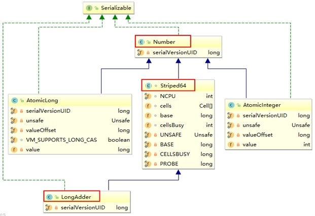
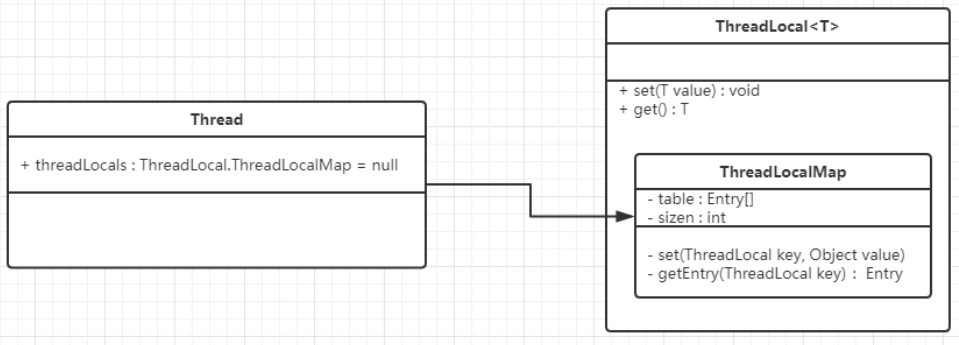
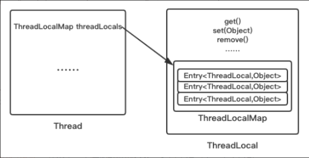
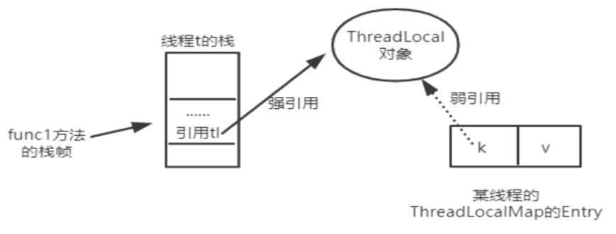
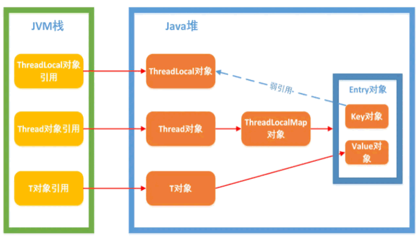

# JUC
1. CompletableFuture：继承Future,扩展，思想可完全替换FutureTask,FutureTask.get()阻塞，
join == get，join不会抛出异常
    ```$xslt
    public class CompletableFuture<T> implements Future<T>, CompletionStage<T>
    ```
2. 主线程不要立刻结束，否则CompletableFuture使用的线程池会立刻关闭
3. CompletableFuture API使用：
    ```$xslt
    a.获得结果和触发计算
    get(),get(long , TimeUnit ),getNow(defaultValue)不会阻塞，立即获取值，计算完毕则返回，否则返回默认值
    boolean complete(defaultValue),执行complete时，结果计算是否完毕。打断成功，返回future.get(),失败则给默认值
    ```

    ```$xslt
    b.对结算结果进行处理 串行化，中间报错就停止：thenApply(Function)-->whenComplete((v,e)->{})-->exceptionally(e->{}).join
    handle((function,e)->{}) 带着异常顺步执行
    总结：exceptionally ===> try catch, whenComplete+handle ==>try finally,
    handleAsync whenCompleteAsync 交给线程池其他线程处理，不带后缀就是一个线程执行
    ```
    ```$xslt
    c.接收任务的处理结果，并进行消费，无返回值 thenAccpet(T t)消费无返回
   任务之间的执行顺序：thenRun(Runnable),thenApply((v)->{return m},thenAccept((v)->{})
   总结：thenRun(Runnable) 任务Ａ执行完后执行Ｂ，但是Ｂ不需要Ａ结果
         thenApply(Function) B需要A结果，同时有返回
         thenAccept(Consumer) B需要A结果，无返回值
    ```
   ```$xslt
   d.对计算速度进行选用 applyToEither()
   两个Step，谁先结束，返回谁的结果
    ```
   ```$xslt
    e. 对计算结果进行合并 thenCombine(),研究thenCompose()
    多个completionStage 先完成的等待后完成的，完成后一起进行结果的合并
    thenCombine(completionFuture,(r1,r2)->{})
    ```
4. 锁
    ```$xslt
    synchronized与reentrantlock 悲观锁  cas 乐观锁
    ```
    - 8种锁现象的演示
    ```$xslt
    类Phone 普通sendEmail() sendSMS()  控制email先与sms启动谁先 
    1. 标准访问 synchronied 修饰普通方法
    2. email 里面 TimeUnit.SECONDS.sleep(3)   => sleep不释放锁
    3. 新增一个普通hello(), email or hello   => hello() 不需要锁
    4. 2部Phone,2个同步方法， phone1.sendEmail,phone2.sendSMS()  => sms synchronized锁当前对象
    5. 两个静态同步方法，同一个手机   => static修饰 锁类对象 email
    6. 两个静态同步方法，2个手机   => static修饰 锁类对象 email
    7. 1个静态同步方法，1个普通同步方法，1个手机   =>  sms
    8. 1个静态同步方法，1个普通同步方法，2个手机   =>  sms 
    ```
    - 8种现象总结
    ```$xslt
    synchronized修饰普通成员方法锁的是this对象，不同对象时，不影响。一个对象时只有一个线程可访问this的syn方法，hello不需要锁
    修饰static方法  锁的是当前类 
    类锁与对象锁互相独立，7-8问题
    修饰代码块，修饰的是括号里配置的对象的锁
    ```
   - synchronized同步代码块 syn(obj)
   ```$xslt
    monitorenter与monitorexit 并非1:1， 多出的monitorexit保证出异常也可正常释放锁
    如果直接在代码块内部抛出异常，出现athrow 1对，enter与exit配对 
    ```
    - synchronized 普通同步方法 syn method(){}
    ```$xslt
       flag： ACC_SYNCHRONIZED 
    ```
    - synchronized static 同步方法 static syn method(){}
    ```$xslt
       flag： ACC_STATIC  ACC_SYNCHRONIZED
       ObjectMonitor.java -> ObjectMonitor.cpp -> ObjectMonitor.hpp
       锁升级主要依赖于MarkWord的锁标志位和释放偏向锁标志位
    ```
    - 公平锁与非公平锁
    ```$xslt
        ReentrantLock 默认非公平锁,Syn是非公平锁
        公平与非公平是判断同步队列中是否有先驱节点，刚释放锁的线程再次获得锁的概率非常大，
        使用非公平的优点是减少线程开销，提高性能，会出现“锁饥饿”
    ```
    - 可重入锁与不可重入锁
    ```$xslt
     syn与reentrantlock都是可重入锁，syn默认可重入锁
     在syn修饰的代码块或者方法中，调用本类的其他同步方法或代码块，可直接进入，是可以直接获取到锁的
     每个对象拥有一个锁计数器和一个指向 持有该锁线程的指针
    ```
5. 死锁
    - 死锁排除
    ```$xslt
    jps+jstack: jps -l  jstack+pid 
    jconsole
    ```
6. 线程中断机制
    - void interrupt() 中断协商机制
    ```$xslt
    手动调用该线程的interrupt()仅仅将中断标识设置为true，线程正常运行，并不能立即中断
   底层调用interrupt0(),在join() wait() sleep()过程中，被中断抛中断异常,
    ```
   **线程立即退出被阻塞状态，中断异常会把标志位复位为false,需要再调用一次Thread.currentThread().interrupt()**
    - static boolean interrupted()
    ```$xslt
    重点：Thread.interrupted() 返回当前的线程中断状态，重置标识位
    ````
    -  boolean isInterrupted()
    ```$xslt
    返回中断状态
    ```
   **总结**: interrupted与IsInterrupted()都调用的是isInterrupted(ClearInterrupted),
   前者传入true，需要重置标志位为false
   - 优雅中断线程
   ```$xslt
    1. static volatile boolean isStop = false 修改变量值，进行中断
    2. static AtomicBoolean a = new AtomicBoolean(false);
        a.set(true);
        if(a.get()){} 
    ```
   
7. LockSupport 线程唤醒与等待
    - Object wait() notify()  (**syn+wait+notify** 会报illegalMonitor) 
    - Condition await() signal() (**lock unlock +await+signal**)
        ReentrantLock lock = new ReentrantLock();
        Condition con = lock.newCondition(); 
    - LockSupport
        是用来创建锁和其他同步类的基本线程阻塞原语，park()阻塞线程 unpark(thread) 解除阻塞,无需关注顺序
        park()将permit设置为0，进行阻塞，unpark()将permit设置为1,不可累加只有1，自动唤醒被阻塞的线程
        
    **总结**: LockSupport无需锁块，且不用遵守先阻塞再唤醒。wait notify和await signal需遵守，unpark只管一次。 
8. 内存屏障
    - JSR-133定义happens-before规则：6点，是一种规范    
    1.顺序规则：线程中的每个操作before后续的操作   
    2.监视器锁规则：解锁before对当前锁的加锁   
    3.volatile变量规则：对一个volatile的写操作，before与任意后续对这个变量的读操作     
    4.传递性：A before B, B before C ===> A before C     
    5.start规则：A线程执行ThreadB.start()，则start()方法beforeB线程中任意操作。   
    6.join规则：线程A执行ThreadB.join() 则线程B中的任意操作before线程A从ThreadB.join操作成功返回。   
    
    要求编译器在生成jvm指令时，插入特定的内存屏障指令来保证指令不会重排序以及有序性。volatile不会保证原子性
    - 4条cpu的屏障指令
    ```$xslt
    loadload() storestore() loadstore() storeload()
    一读，二写，写+读  (写前后，读后)。写前：storestore 写后storeload 读后loadstore loadload
    (解释：第一个是volatile读时，不可重排序，保证volatile读后的操作不会被重排序到前面去)
    (第二个是volatile写时，不可重排序，保证volatile写前的操作不会被重排序到后面去)
    (第一个是volatile写时，第二个是volatile读时，不可重排序)
    volatile写之前插入storestore屏障，之后插入storeload屏障
    volatile读后面插入一个loadload屏障，之后插入一个loadstore屏障
    ```
    - volatile读写过程
    ```$xslt
    read ->load -> use(使用) -> assign(赋值) -> store -> write -> lock -> unlock  
    ```
   
    - volatile复合操作(i++)不具备原子性
    不具备原子性的原因在于use-> assign阶段 方法需要加syn锁
    所以volatile修饰的变量，只适合用来保存某个状态的Boolean值或者int值，不做复杂操作    
9. CAS   
CAS是JDK提供的非阻塞原子性操作，它通过硬件保证了比较-更新的原子性。CAS是一条CPU的原子指令（cmpxchg指令），不会造成所谓的数据不一致问题，Unsafe提供的CAS方法（如compareAndSwapXXX）底层实现即为CPU指令cmpxchg。
执行cmpxchg指令的时候，会判断当前系统是否为多核系统，如果是就给总线加锁，只有一个线程会对总线加锁成功，加锁成功之后会执行cas操作，也就是说CAS的原子性实际上是CPU实现的， 其实在这一点上还是有排他锁的，只是比起用synchronized， 这里的排他时间要短的多， 所以在多线程情况下性能会比较好   
    - 1. Unsafe   
      是CAS的核心类，由于Java方法无法直接访问底层系统，需要通过本地（native）方法来访问，Unsafe相当于一个后门，基于该类可以直接操作特定内存的数据。Unsafe类存在于sun.misc包中，其内部方法操作可以像C的指针一样直接操作内存，因为Java中CAS操作的执行依赖于Unsafe类的方法，注意Unsafe类中的所有方法都是native修饰的，也就是说Unsafe类中的方法都直接调用操作系统底层资源执行相应任务。
        ```$xslt
        public final boolean compareAndSet(int expect, int update) {
            // valueOffset表示在内存中的偏移地址
            return unsafe.compareAndSwapInt(this, valueOffset, expect, update);
         }
      // volatile修饰value保证可见性
       private volatile int value;
       public final int get() {
              return value;
          }
        ``` 
      AtomicInteger 类主要利用 CAS (compare and swap) + volatile 和 native 方法来保证原子操作，从而避免 synchronized 的高开销，执行效率大为提升。    
      CAS并发原语体现在JAVA语言中就是sun.misc.Unsafe类中的各个方法。调用UnSafe类中的CAS方法，JVM会帮我们实现出CAS汇编指令。这是一种完全依赖于硬件的功能，通过它实现了原子操作。再次强调，由于CAS是一种系统原语，原语属于操作系统用语范畴，是由若干条指令组成的，用于完成某个功能的一个过程，并且原语的执行必须是连续的，在执行过程中不允许被中断，也就是说CAS是一条CPU的原子指令，不会造成所谓的数据不一致问题。
        ```$xslt
       public final int getAndAddInt(Object var1, long var2, int var4) {
           int var5;
           do {
      //获取内存地址中的值
               var5 = this.getIntVolatile(var1, var2);
      // 此刻由var1,var2得到的值与旧值var5进行比较，是则var5+var4
      //保证是在最新的值上进行var5+var4，而不是在旧值上进行操作
           } while(!this.compareAndSwapInt(var1, var2, var5, var5 + var4));
   
           return var5;
       } 
        ```      
      **核心思想就是：比较要更新变量的值V和预期值E（compare），相等才会将V的值设为新值N（swap）如果不相等自旋再来。**
     - 2.AtomicReference      
      同原子类类似。   
     - 3.AtomicStampedReference     
      解决ABA问题 [ABAdemo](./src/main/java/com/yun/cas/ABADemo.java)
10. 原子类操作之增强    
    - 1.是什么    
     package java.util.concurrent.atomic下面的所有类     
     基本类型原子类:AtomicInteger,AtomicLong,AtomicBoolean    
     数组类型原子类:AtomicIntegerArray,AtomicLongArray,AtomicReferenceArray    
     引用类型原子类：AtomicReference
    - 2.使用API    
     [AtomicIntegerDemo](./src/main/java/com/yun/atomics/AtomicIntegerDemo.java)     
     [对象的属性修改原子类](./src/main/java/com/yun/atomics/AtomicIntegerFieldUpdaterDemo.java)    
    - 3.原子操作增强类原理深度解析    
    	DoubleAccumulator   
    	DoubleAdder    
    	[LongAccumulator(提供了自定义的函数操作)](./src/main/java/com/yun/atomics/LongAdderCalcDemo.java)   
    	[LongAdder(只能用来计算加法，且从零开始计)](./src/main/java/com/yun/atomics/LongAdderAPIDemo.java)    
    	LongAdder： long sum() 返回的是当前值。 在没有并发时返回精确值，存在并发不能保证返回精确值    
    	[速度大比拼](./src/main/java/com/yun/atomics/LongAdde+   rCalcDemo.java)
    - 4.LongAdder为什么这么快？   
        LongAdder是Striped64的子类,striped64采用base+cell[]   
        
        AtomicLong:  base + cas 在并发低的情况下可以满足   
        LongAdder: 使用分而治之的思想使用cell,CPU的数量决定cell的个数，base并发上去升级后才会触发cell.即多个cell，分别采用cas。获取总数需要求和base+cell[]     
        通过thread_id hash算cell 索引     
        **缺陷：sum求和后还有计算线程修改结果的话，最后结果不够准确**	
    - 5.AtomicLong瓶颈      
        N个线程CAS操作修改线程的值，每次只有一个成功过，其它N - 1失败，失败的不停的自旋直到成功，这样大量失败自旋的情况，一下子cpu就打高了。
    
11. ThreadLocal   
ThreadLocal与ThreadLocalMap关系？ThreadLocal中的key是弱引用？内存泄露为什么？为什么增加remove方法？     
        
    
    - 1.用途：     
    a.每个线程需要一个独享的对象，通常对象指工具类SimpleDateFormat和Random    
    b.每个线程需要保存全局的变量，这里如在拦截器中拦截的用户信息，避免参数传递的麻烦
    - 2.理解：   
    a.每个thread对应一个threadlocalMap,threadLocalMap里面存放多个threadLocal,key即为threadlocal引用,value为任意值的entry。    
    b.不用ThreadLocal，因为SimpleDateFormat是static线程不安全，底层在每次使用完calender后悔调用cal.clear清除，导致报错。    
    c.JVM内部维护了一个线程版的Map<Thread,T>(通过ThreadLocal对象的set方法，结果把ThreadLocal对象自己当做key，放进了ThreadLoalMap中),每个线程要用到这个T的时候，用当前的线程去Map里面获取，通过这样让每个线程都拥有了自己独立的变量，
      人手一份，竞争条件被彻底消除，在并发模式下是绝对安全的变量。
    d.Thread -->ThreadLocal -->ThreadLocalMap --> Entry 4个类   
    ```$xslt
         static class Entry extends WeakReference<ThreadLocal<?>> {
                    /** The value associated with this ThreadLocal. */
                    Object value;
        
                    Entry(ThreadLocal<?> k, Object v) {
                        super(k);
                        value = v;
                    }
                }
    ```    
        
        
    在线程栈中，func1方法栈帧中结束退出后tl被销毁，此时threadLocal对象，因为ThreadLocalMap中的Entry使用的是弱引用指向，无强引用指向，所以会被回收，相反如果也是强引用指向的话threadLocal对象会一直存在，则会导致内存泄露。所以图中的k此时指向Null,这里和threadLocal的get方法有关，get方法得到的是对象，所以整个Entry对象是<thread,T>。     
    只要线程没有被销毁，那么threadlocalmap就会一直存在，key为Null,value为大对象。虽然弱引用，保证了key指向的ThreadLocal对象能被及时回收，但是v指向的value对象是需要ThreadLocalMap调用get、set时发现key为null时才会去回收整个entry、value，因此弱引用不能100%保证内存不泄露。我们要在不使用某个ThreadLocal对象后，手动调用remoev方法来删除它。     
    - 3. 总结
    	a.ThreadLocal 并不解决线程间共享数据的问题
    	b.ThreadLocal 适用于变量在线程间隔离且在方法间共享的场景
    	c.ThreadLocal 通过隐式的在不同线程内创建独立实例副本避免了实例线程安全的问题
    	d.每个线程持有一个只属于自己的专属Map并维护了ThreadLocal对象与具体实例的映射， 该Map由于只被持有它的线程访问，故不存在线程安全以及锁的问题
    	e.ThreadLocalMap的Entry对ThreadLocal的引用为弱引用，避免了ThreadLocal对象无法被回收的问题
    	f.都会通过expungeStaleEntry，cleanSomeSlots,replaceStaleEntry这三个方法回收键为 null 的 Entry 对象的值（即为具体实例）以及 Entry 对象本身从而防止内存泄漏，属于安全加固的方法


     
    
    
    